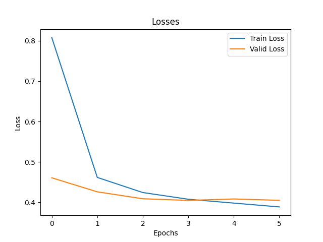
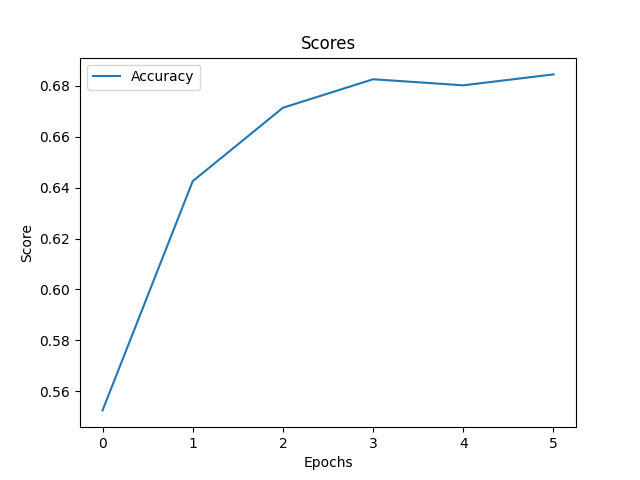
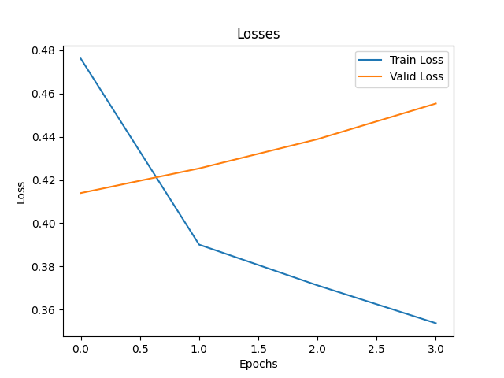
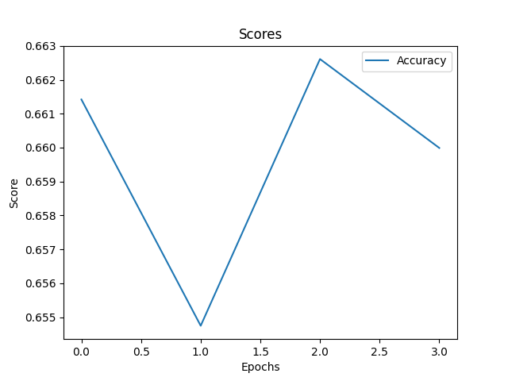

# T5 for Comparing Text Difficulty <!-- omit from toc -->

This repository contains a neural network model based on the T5 model that compares two texts and outputs which one is easier to understand.

## Table of Contents <!-- omit from toc -->
- [Introduction](#introduction)
- [Results](#results)
- [Getting Started](#getting-started)
  - [Prerequisites](#prerequisites)
  - [Usage](#usage)
  - [Training](#training)
    - [Arguments](#arguments)
  - [Evaluation](#evaluation)
    - [Arguments](#arguments-1)
  - [Inference](#inference)
    - [Arguments](#arguments-2)
- [Plots](#plots)
  - [Based on t5-small](#based-on-t5-small)
  - [Based on t5-base](#based-on-t5-base)
- [Authors](#authors)


## Introduction

The problem was formulated as a question answering one: Given a `context`, containing `Text A` and `Text B`, the model was asked a `question`: `Which of Text A and Text B is easier to understand?`. Variations on the questions were done, such as `Which of Text A and Text B is easier to understand?` or `Which of Text A and Text B is easier to understand?`, with the optional addition of `1 for Text A, 0 for Text B.` at the end. No significant changes occured in the results, so the model was trained with the first question + the optional addition, due to easier formatting of the output. One thing that did improve the results somewhat was the removal of newlines from the texts, as the model was trained on a single line of text.

## Results

The model was trained on a custom dataset, containing 4724 unique texts and 47478 pairs of texts. The dataset was split into 38939 pairs for training, 4194 pairs for validation and 4345 pairs for test. The model was tested starting from `t5-base` and `t5-small`, with varying parameters for learning rate, batch size and number of epochs. The model was evaluated on the validation set and SOME OF the results are the following:

| Model | Batch Size | Learning Rate | Epochs | Accuracy |
| --- | --- | --- | --- | --- |
| t5-base | 4 | - | - | 0.0 |
| t5-small | 4 | - | - | 0.0 |
| t5-base + training | 16 | 1e-4 | 4 | 0.0 |
| t5-small + training | 64 | 1e-4 | 6 | 68.4% |
| t5-small + training | 32 | 1e-4 | 10 | 67.5% |
| t5-small + training | 32 | 1e-3 | 10 | 65.35% |


Since the training was arriving at a plateau after not too many epochs, I didn't find the need to test it for more. The results are not very good, but they are better than random guessing, which would have an accuracy of 50%. The model was trained both on single and two GPUs, with no significant changes in the final accuracy. Also, no significant changes were observed when using the `t5-base` model instead of the `t5-small` one, even though the resources required for training the former were much higher. Some plots can be found in the [Plots](##Plots) section.


## Getting Started

These instructions will get you a copy of the project up and running on your local machine for development and testing purposes.

### Prerequisites

- Python 3.7 or higher
- PyTorch 1.12 or higher


### Usage

1) Clone the repository.

```bash
git clone https://github.com/pdragoi/t5-text-simplicity.git
```

2) Install the requirements.

```bash
pip install -r requirements.txt
```

3) Create your own dataset. 

   The dataset should be a CSV file with three columns (`Text A`, `Text B` and `Result`) and another CSV with two columns (`id` and `text`). The latter one should contain the texts, with a unique id for each one, while the former one should contain the pairs of texts and the result of the comparison. The result should be `1` if the first text is easier to understand and `0` i the second text is easier to understand. The dataset should be saved in the `dataset` folder, and it expects three files: `train.csv`, `validation.csv` and `test.csv` for the data split, and `texts.csv` for the corpus. The paths can be modified (see the [arguments](#arguments) section).

   The script for create a `Dataset` can be found in the [dataset.py](dataset.py) file and modified according to your needs.

### Training

To train the model, run the following command:

```bash
python train.py
```

#### Arguments

- `--base_model`: The model from which to start the training. Default: `t5-small`.
- `--tokenizer`: The tokenizer to use. Default: `t5-small`.
- `--batch_size`: The batch size. Default: `4`.
- `--epochs`: The number of epochs. Default: `10`.
- `--lr`: The learning rate. Default: `1e-4`.
- `--train_file`: The path to the CSV file containing the mapping for the training corpus. See [Usage](###Usage) . Default: `./dataset/train.csv`.
- `--valid_file`: The path to the CSV file containing the mapping for the validation corpus. See [Usage](###Usage) . Default: `./dataset/validation.csv`.
- `--texts`: The path to the CSV file containing the texts. See [Usage](###Usage) . Default: `./dataset/texts.csv`.
- `--device`: The device to use. Default: `cuda` if available, `cpu` otherwise.
- `--max_length`: The maximum tokens length of the input. Default: `512`.
- `--shuffle`: Whether to shuffle the dataset. Default: `False`. 
- `--seed`: The seed for the random number generator. Default: `42`.
- `--debug`: Whether to run the script in debug mode. Default: `False`.
- `--model_name`: The name of the model to be saved. Default: `base`.
- `--save_all`: Whether to save all the models or only the best one. Default: `False`.


### Evaluation

To evaluate the model, run the following command:

```bash
python evaluation.py
```

#### Arguments

- `--model`: The path to the model or prebuilt model to be evaluated. Default: `t5-small`.
- `--tokenizer`: The path to the tokenizer or prebuilt tokenizer to use. Default: `t5-small`.
- `--batch_size`: The batch size. Default: `8`.
- `--test_file`: The path to the CSV file containing the mapping for the test corpus. See [Usage](###Usage) . Default: `./dataset/validation.csv`.
- `--texts`: The path to the CSV file containing the texts. See [Usage](###Usage) . Default: `./dataset/texts.csv`.
- `--device`: The device to use. Default: `cuda` if available, `cpu` otherwise.
- `--max_length`: The maximum tokens length of the input. Default: `512`.
- `--shuffle`: Whether to shuffle the dataset. Default: `False`.
- `--seed`: The seed for the random number generator. Default: `42`.
- `--debug`: Whether to run the script in debug mode. Default: `False`.


### Inference

To use the model for inference, run the following command:

```bash
python inference.py
```

#### Arguments

- `--model`: The path to the model or prebuilt model to be evaluated. Default: `t5-small`.
- `--tokenizer`: The path to the tokenizer or prebuilt tokenizer to use. Default: `t5-small`.
- `--batch_size`: The batch size. Default: `8`.
- `--test_file`: The path to the CSV file containing the mapping for the test corpus. See [Usage](###Usage) . Default: `./dataset/test.csv`.
- `--texts`: The path to the CSV file containing the texts. See [Usage](###Usage) . Default: `./dataset/texts.csv`.
- `--device`: The device to use. Default: `cuda` if available, `cpu` otherwise.
- `--max_length`: The maximum tokens length of the input. Default: `512`.
- `--shuffle`: Whether to shuffle the dataset. Default: `False`.
- `--seed`: The seed for the random number generator. Default: `42`.
- `--debug`: Whether to run the script in debug mode. Default: `False`.
- `--save_path`: The path to save the predictions. Default: `./predictions.csv`.


## Plots

### Based on t5-small



### Based on t5-base




## Authors

* **Paul Dragoi** - *Initial work* - [pdragoi](https://github.com/pdragoi)
